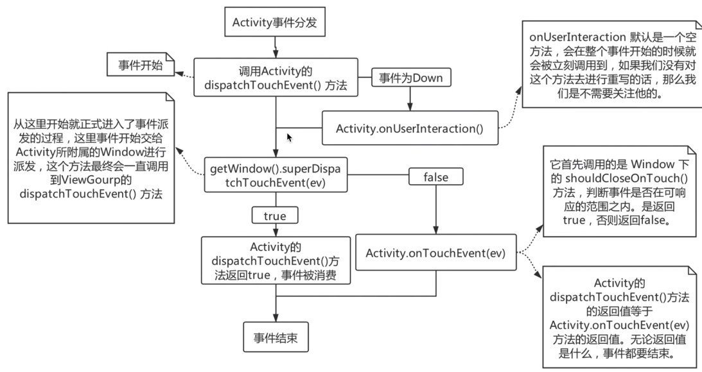
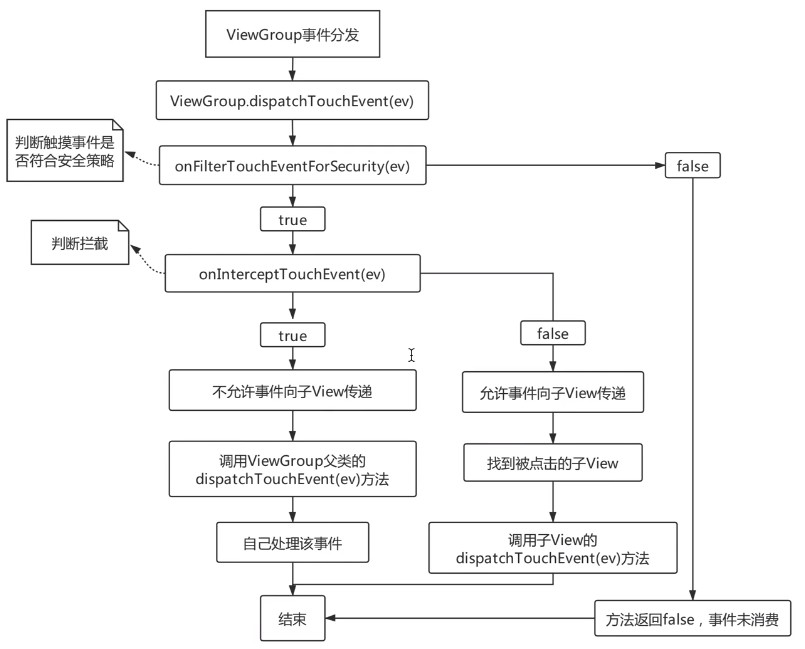
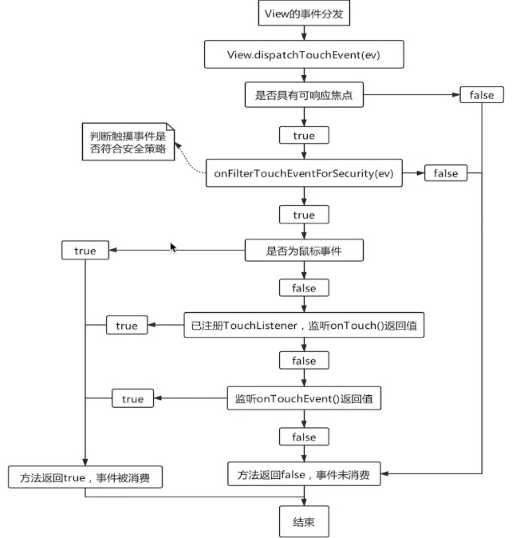

# 事件分发机制

[toc]

## 1. 概述

**事件：**用户通过屏幕与手机交互的时候，每一次**点击、长按、移动**等都是一个事件。

**事件分发：**某一个事件从屏幕传递给各个ViewGroup或View，由ViewGroup或View来使用这一事件（消费事件）或者忽略这一事件（不消费事件），这个事件的传递及处理过程就叫做事件分发。

**事件定义：**系统把事件封装为MotionEvent对象，事件分发的过程就是MotionEvent分发的过程。

- ACTION_DOWN：按下。
- ACTION_MOVE：移动。
- ACTION_UP：上升。
- ACTION_CANCEL：取消。该事件应该将其视为上升事件，但不要执行通常会执行的任何操作。

**事件序列：**从手指按下开始到手指离开屏幕所产生的一系列事件。

**传递层级：**Activity -> Window -> DecorView -> ViewGroup -> View。

在Android中，Activity不负责视图的控制，只是控制生命周期和事件处理。真正控制视图的是Window。一个Activity包含了一个Window，一个Window才真正代表了一个窗口，而在一个Window中包含了一个DecorView，DecorView是一个顶级的View，该DecorView继承自FrameLayout。

**主要传递对象及顺序：**Activity -> ViewGroup -> View。

## 2. Activity的事件分发

此部分源码在android.app.Activity.java中

```java
/**
 * Called to process touch screen events.  You can override this to
 * intercept all touch screen events before they are dispatched to the
 * window.  Be sure to call this implementation for touch screen events
 * that should be handled normally.
 *
 * @param ev The touch screen event.
 *
 * @return boolean Return true if this event was consumed.
 */
public boolean dispatchTouchEvent(MotionEvent ev) {
    if (ev.getAction() == MotionEvent.ACTION_DOWN) {
        onUserInteraction();
    }
    if (getWindow().superDispatchTouchEvent(ev)) {
        return true;
    }
    return onTouchEvent(ev);
}

/**
 * Called when a touch screen event was not handled by any of the views
 * under it.  This is most useful to process touch events that happen
 * outside of your window bounds, where there is no view to receive it.
 *
 * @param event The touch screen event being processed.
 *
 * @return Return true if you have consumed the event, false if you haven't.
 * The default implementation always returns false.
 */
public boolean onTouchEvent(MotionEvent event) {
    if (mWindow.shouldCloseOnTouch(this, event)) {
        finish();
        return true;
    }

    return false;
}
```

```java
public abstract class Window {
    // 这里可以联想到Dialog点击Dialog以外区域，Dialog消失
    public boolean shouldCloseOnTouch(Context context, MotionEvent event) {
        final boolean isOutside =
                event.getAction() == MotionEvent.ACTION_UP && isOutOfBounds(context, event)
                || event.getAction() == MotionEvent.ACTION_OUTSIDE;
        if (mCloseOnTouchOutside && peekDecorView() != null && isOutside) {
            return true;
        }
        return false;
    }
}
```

从Activity当中调用到PhoneWindow中的superDispatchTouchEvent方法，继而调用mDecor的superDispatchTouchEvent，实际上mDecor是一个FrameLayout，是Activity的最顶层View。从而事件传递到ViewGroup当中。

```java
public class PhoneWindow extends Window implements MenuBuilder.Callback {
	@Override
	public boolean superDispatchTouchEvent(MotionEvent event) {
    	return mDecor.superDispatchTouchEvent(event);
	}
}
```

从PhoneWindow当中调用super.dispatchTouchEvent(event)。从而调用到父类ViewGroup当中

```java
/** @hide */
public class DecorView extends FrameLayout implements RootViewSurfaceTaker, WindowCallbacks {
	public boolean superDispatchTouchEvent(MotionEvent event) {
        return super.dispatchTouchEvent(event);
    }
}
```



## 3.ViewGroup的事件分发

ViewGroup当中涉及到事件分发的主要方法

- dispatchTouchEvent(MotionEvent ev)，进入到这个方法，表明事件已经进入到ViewGroup里面。
- onInterceptTouchEvent(MotionEvent ev)，该方法在事件分发过程中被调用，如果该方法返回true，则表明当前的ViewGroup会拦截掉事件，也就是说当前的事件不会再往下进行传递，如果该方法返回false，说明当前ViewGroup不会拦截该事件。
- onTouchEvent(MotionEvent ev)，在ViewGroup当中没有实现该方法，该方法在View中进行实现。




```java
@UiThread
public abstract class ViewGroup extends View implements ViewParent, ViewManager {
    // 该方法主要完成以下三件事情
    // 1、判断是否需要拦截事件；
    // 2、如果不需要拦截，找到当前ViewGroup中用户真正点击的View；
    // 3、分发事件到View上。
	@Override
    public boolean dispatchTouchEvent(MotionEvent ev) {
        if (mInputEventConsistencyVerifier != null) {
            mInputEventConsistencyVerifier.onTouchEvent(ev, 1);
        }

        // If the event targets the accessibility focused view and this is it, start
        // normal event dispatch. Maybe a descendant is what will handle the click.
        if (ev.isTargetAccessibilityFocus() && isAccessibilityFocusedViewOrHost()) {
            ev.setTargetAccessibilityFocus(false);
        }

        boolean handled = false;
        // 如果该事件不符合安全策略，则不分发该事件。
        // 安全策略：如果ViewGroup不可见，则返回false；反之，true，表明需要分发该事件
        if (onFilterTouchEventForSecurity(ev)) {
            final int action = ev.getAction();
            final int actionMasked = action & MotionEvent.ACTION_MASK;

            // 当MotionEvent是按下时，会做一系列的初始化动作。
            // Handle an initial down.
            if (actionMasked == MotionEvent.ACTION_DOWN) {
                // Throw away all previous state when starting a new touch gesture.
                // The framework may have dropped the up or cancel event for the previous gesture
                // due to an app switch, ANR, or some other state change.
                cancelAndClearTouchTargets(ev);
                resetTouchState();
            }

            // 检测拦截
            // Check for interception.
            final boolean intercepted;
            if (actionMasked == MotionEvent.ACTION_DOWN
                    || mFirstTouchTarget != null) {
                // 如果给ViewGroup设置了禁止拦截标识，则disallowIntercept为false
                final boolean disallowIntercept = (mGroupFlags & FLAG_DISALLOW_INTERCEPT) != 0;
                if (!disallowIntercept) {
                    // 根据onInterceptTouchEvent的实现决定是否拦截MotionEvent
                    intercepted = onInterceptTouchEvent(ev);
                    ev.setAction(action); // restore action in case it was changed
                } else {
                    intercepted = false;
                }
            } else {
                // There are no touch targets and this action is not an initial down
                // so this view group continues to intercept touches.
                intercepted = true;
            }

            // If intercepted, start normal event dispatch. Also if there is already
            // a view that is handling the gesture, do normal event dispatch.
            if (intercepted || mFirstTouchTarget != null) {
                ev.setTargetAccessibilityFocus(false);
            }

            // Check for cancelation.
            final boolean canceled = resetCancelNextUpFlag(this)
                    || actionMasked == MotionEvent.ACTION_CANCEL;

            // Update list of touch targets for pointer down, if needed.
            final boolean isMouseEvent = ev.getSource() == InputDevice.SOURCE_MOUSE;
            // 当前事件是否分发给多个重叠的子View
            final boolean split = (mGroupFlags & FLAG_SPLIT_MOTION_EVENTS) != 0
                    && !isMouseEvent;
            TouchTarget newTouchTarget = null;
            boolean alreadyDispatchedToNewTouchTarget = false;
            // 如果当前事件不是取消事件并且不拦截该事件
            if (!canceled && !intercepted) {
                // If the event is targeting accessibility focus we give it to the
                // view that has accessibility focus and if it does not handle it
                // we clear the flag and dispatch the event to all children as usual.
                // We are looking up the accessibility focused host to avoid keeping
                // state since these events are very rare.
                View childWithAccessibilityFocus = ev.isTargetAccessibilityFocus()
                        ? findChildWithAccessibilityFocus() : null;

                if (actionMasked == MotionEvent.ACTION_DOWN
                        || (split && actionMasked == MotionEvent.ACTION_POINTER_DOWN)
                        || actionMasked == MotionEvent.ACTION_HOVER_MOVE) {
                    final int actionIndex = ev.getActionIndex(); // always 0 for down
                    final int idBitsToAssign = split ? 1 << ev.getPointerId(actionIndex)
                            : TouchTarget.ALL_POINTER_IDS;

                    // Clean up earlier touch targets for this pointer id in case they
                    // have become out of sync.
                    removePointersFromTouchTargets(idBitsToAssign);

                    final int childrenCount = mChildrenCount;
                    if (newTouchTarget == null && childrenCount != 0) {
                        final float x =
                                isMouseEvent ? ev.getXCursorPosition() : ev.getX(actionIndex);
                        final float y =
                                isMouseEvent ? ev.getYCursorPosition() : ev.getY(actionIndex);
                        // 找到一个能接收处理该事件的子View
                        // Find a child that can receive the event.
                        // Scan children from front to back.
                        final ArrayList<View> preorderedList = buildTouchDispatchChildList();
                        final boolean customOrder = preorderedList == null
                                && isChildrenDrawingOrderEnabled();
                        final View[] children = mChildren;
                        for (int i = childrenCount - 1; i >= 0; i--) {
                            final int childIndex = getAndVerifyPreorderedIndex(
                                    childrenCount, i, customOrder);
                            final View child = getAndVerifyPreorderedView(
                                    preorderedList, children, childIndex);
                            if (!child.canReceivePointerEvents()
                                    || !isTransformedTouchPointInView(x, y, child, null)) {
                                continue;
                            }

                            newTouchTarget = getTouchTarget(child);
                            if (newTouchTarget != null) {
                                // Child is already receiving touch within its bounds.
                                // Give it the new pointer in addition to the ones it is handling.
                                newTouchTarget.pointerIdBits |= idBitsToAssign;
                                break;
                            }

                            resetCancelNextUpFlag(child);
                            if (dispatchTransformedTouchEvent(ev, false, child, idBitsToAssign)) {
                                // Child wants to receive touch within its bounds.
                                mLastTouchDownTime = ev.getDownTime();
                                if (preorderedList != null) {
                                    // childIndex points into presorted list, find original index
                                    for (int j = 0; j < childrenCount; j++) {
                                        if (children[childIndex] == mChildren[j]) {
                                            mLastTouchDownIndex = j;
                                            break;
                                        }
                                    }
                                } else {
                                    mLastTouchDownIndex = childIndex;
                                }
                                mLastTouchDownX = ev.getX();
                                mLastTouchDownY = ev.getY();
                                newTouchTarget = addTouchTarget(child, idBitsToAssign);
                                alreadyDispatchedToNewTouchTarget = true;
                                break;
                            }

                            // The accessibility focus didn't handle the event, so clear
                            // the flag and do a normal dispatch to all children.
                            ev.setTargetAccessibilityFocus(false);
                        }
                        if (preorderedList != null) preorderedList.clear();
                    }

                    if (newTouchTarget == null && mFirstTouchTarget != null) {
                        // Did not find a child to receive the event.
                        // Assign the pointer to the least recently added target.
                        newTouchTarget = mFirstTouchTarget;
                        while (newTouchTarget.next != null) {
                            newTouchTarget = newTouchTarget.next;
                        }
                        newTouchTarget.pointerIdBits |= idBitsToAssign;
                    }
                }
            }

            // Dispatch to touch targets.
            if (mFirstTouchTarget == null) {
                // No touch targets so treat this as an ordinary view.
                handled = dispatchTransformedTouchEvent(ev, canceled, null,
                        TouchTarget.ALL_POINTER_IDS);
            } else {
                // Dispatch to touch targets, excluding the new touch target if we already
                // dispatched to it.  Cancel touch targets if necessary.
                TouchTarget predecessor = null;
                TouchTarget target = mFirstTouchTarget;
                while (target != null) {
                    final TouchTarget next = target.next;
                    if (alreadyDispatchedToNewTouchTarget && target == newTouchTarget) {
                        handled = true;
                    } else {
                        final boolean cancelChild = resetCancelNextUpFlag(target.child)
                                || intercepted;
                        if (dispatchTransformedTouchEvent(ev, cancelChild,
                                target.child, target.pointerIdBits)) {
                            handled = true;
                        }
                        if (cancelChild) {
                            if (predecessor == null) {
                                mFirstTouchTarget = next;
                            } else {
                                predecessor.next = next;
                            }
                            target.recycle();
                            target = next;
                            continue;
                        }
                    }
                    predecessor = target;
                    target = next;
                }
            }

            // Update list of touch targets for pointer up or cancel, if needed.
            if (canceled
                    || actionMasked == MotionEvent.ACTION_UP
                    || actionMasked == MotionEvent.ACTION_HOVER_MOVE) {
                resetTouchState();
            } else if (split && actionMasked == MotionEvent.ACTION_POINTER_UP) {
                final int actionIndex = ev.getActionIndex();
                final int idBitsToRemove = 1 << ev.getPointerId(actionIndex);
                removePointersFromTouchTargets(idBitsToRemove);
            }
        }

        if (!handled && mInputEventConsistencyVerifier != null) {
            mInputEventConsistencyVerifier.onUnhandledEvent(ev, 1);
        }
        return handled;
    }
}
```

```java
@UiThread
public class View implements Drawable.Callback, KeyEvent.Callback,
    /**
     * Filter the touch event to apply security policies.
     *
     * @param event The motion event to be filtered.
     * @return True if the event should be dispatched, false if the event should be dropped.
     *
     * @see #getFilterTouchesWhenObscured
     */
	// 当前ViewGroup被遮挡或不可见，则不处理事件
    public boolean onFilterTouchEventForSecurity(MotionEvent event) {
        //noinspection RedundantIfStatement
        if ((mViewFlags & FILTER_TOUCHES_WHEN_OBSCURED) != 0
                && (event.getFlags() & MotionEvent.FLAG_WINDOW_IS_OBSCURED) != 0) {
            // Window is obscured, drop this touch.
            return false;
        }
        return true;
    }
]
```


## 4.View的事件分发

View当中涉及事件分发的主要方法

- dispatchTouchEvent(MotionEvent ev)，进入到这个方法，表明事件已经进入到View里面。
- onTouchEvent(MotionEvent ev)，处理用户触摸事件的逻辑都会在此方法中实现。



```java
@UiThread
public class View implements Drawable.Callback, KeyEvent.Callback,
        AccessibilityEventSource {	
	/**
     * Pass the touch screen motion event down to the target view, or this
     * view if it is the target.
     *
     * @param event The motion event to be dispatched.
     * @return True if the event was handled by the view, false otherwise.
     */
    public boolean dispatchTouchEvent(MotionEvent event) {
        // If the event should be handled by accessibility focus first.
        if (event.isTargetAccessibilityFocus()) {
            // We don't have focus or no virtual descendant has it, do not handle the event.
            if (!isAccessibilityFocusedViewOrHost()) {
                return false;
            }
            // We have focus and got the event, then use normal event dispatch.
            event.setTargetAccessibilityFocus(false);
        }
        boolean result = false;

        if (mInputEventConsistencyVerifier != null) {
            mInputEventConsistencyVerifier.onTouchEvent(event, 0);
        }

        final int actionMasked = event.getActionMasked();
        if (actionMasked == MotionEvent.ACTION_DOWN) {
            // Defensive cleanup for new gesture
            stopNestedScroll();
        }

        if (onFilterTouchEventForSecurity(event)) {
            if ((mViewFlags & ENABLED_MASK) == ENABLED && handleScrollBarDragging(event)) {
                result = true;
            }
            //noinspection SimplifiableIfStatement
            ListenerInfo li = mListenerInfo;
            if (li != null && li.mOnTouchListener != null
                    && (mViewFlags & ENABLED_MASK) == ENABLED
                    && li.mOnTouchListener.onTouch(this, event)) {
                result = true;
            }

            if (!result && onTouchEvent(event)) {
                result = true;
            }
        }

        if (!result && mInputEventConsistencyVerifier != null) {
            mInputEventConsistencyVerifier.onUnhandledEvent(event, 0);
        }

        // Clean up after nested scrolls if this is the end of a gesture;
        // also cancel it if we tried an ACTION_DOWN but we didn't want the rest
        // of the gesture.
        if (actionMasked == MotionEvent.ACTION_UP ||
                actionMasked == MotionEvent.ACTION_CANCEL ||
                (actionMasked == MotionEvent.ACTION_DOWN && !result)) {
            stopNestedScroll();
        }

        return result;
    }

	/**
     * Implement this method to handle touch screen motion events.
     * <p>
     * If this method is used to detect click actions, it is recommended that
     * the actions be performed by implementing and calling
     * {@link #performClick()}. This will ensure consistent system behavior,
     * including:
     * <ul>
     * <li>obeying click sound preferences
     * <li>dispatching OnClickListener calls
     * <li>handling {@link AccessibilityNodeInfo#ACTION_CLICK ACTION_CLICK} when
     * accessibility features are enabled
     * </ul>
     *
     * @param event The motion event.
     * @return True if the event was handled, false otherwise.
     */
    public boolean onTouchEvent(MotionEvent event) {
        final float x = event.getX();
        final float y = event.getY();
        final int viewFlags = mViewFlags;
        final int action = event.getAction();

        final boolean clickable = ((viewFlags & CLICKABLE) == CLICKABLE
                || (viewFlags & LONG_CLICKABLE) == LONG_CLICKABLE)
                || (viewFlags & CONTEXT_CLICKABLE) == CONTEXT_CLICKABLE;

        if ((viewFlags & ENABLED_MASK) == DISABLED) {
            if (action == MotionEvent.ACTION_UP && (mPrivateFlags & PFLAG_PRESSED) != 0) {
                setPressed(false);
            }
            mPrivateFlags3 &= ~PFLAG3_FINGER_DOWN;
            // A disabled view that is clickable still consumes the touch
            // events, it just doesn't respond to them.
            return clickable;
        }
        if (mTouchDelegate != null) {
            if (mTouchDelegate.onTouchEvent(event)) {
                return true;
            }
        }

        if (clickable || (viewFlags & TOOLTIP) == TOOLTIP) {
            switch (action) {
                case MotionEvent.ACTION_UP:
                    mPrivateFlags3 &= ~PFLAG3_FINGER_DOWN;
                    if ((viewFlags & TOOLTIP) == TOOLTIP) {
                        handleTooltipUp();
                    }
                    if (!clickable) {
                        removeTapCallback();
                        removeLongPressCallback();
                        mInContextButtonPress = false;
                        mHasPerformedLongPress = false;
                        mIgnoreNextUpEvent = false;
                        break;
                    }
                    boolean prepressed = (mPrivateFlags & PFLAG_PREPRESSED) != 0;
                    if ((mPrivateFlags & PFLAG_PRESSED) != 0 || prepressed) {
                        // take focus if we don't have it already and we should in
                        // touch mode.
                        boolean focusTaken = false;
                        if (isFocusable() && isFocusableInTouchMode() && !isFocused()) {
                            focusTaken = requestFocus();
                        }

                        if (prepressed) {
                            // The button is being released before we actually
                            // showed it as pressed.  Make it show the pressed
                            // state now (before scheduling the click) to ensure
                            // the user sees it.
                            setPressed(true, x, y);
                        }

                        if (!mHasPerformedLongPress && !mIgnoreNextUpEvent) {
                            // This is a tap, so remove the longpress check
                            removeLongPressCallback();

                            // Only perform take click actions if we were in the pressed state
                            if (!focusTaken) {
                                // Use a Runnable and post this rather than calling
                                // performClick directly. This lets other visual state
                                // of the view update before click actions start.
                                if (mPerformClick == null) {
                                    mPerformClick = new PerformClick();
                                }
                                if (!post(mPerformClick)) {
                                    performClickInternal();
                                }
                            }
                        }

                        if (mUnsetPressedState == null) {
                            mUnsetPressedState = new UnsetPressedState();
                        }

                        if (prepressed) {
                            postDelayed(mUnsetPressedState,
                                    ViewConfiguration.getPressedStateDuration());
                        } else if (!post(mUnsetPressedState)) {
                            // If the post failed, unpress right now
                            mUnsetPressedState.run();
                        }

                        removeTapCallback();
                    }
                    mIgnoreNextUpEvent = false;
                    break;

                case MotionEvent.ACTION_DOWN:
                    if (event.getSource() == InputDevice.SOURCE_TOUCHSCREEN) {
                        mPrivateFlags3 |= PFLAG3_FINGER_DOWN;
                    }
                    mHasPerformedLongPress = false;

                    if (!clickable) {
                        checkForLongClick(
                                ViewConfiguration.getLongPressTimeout(),
                                x,
                                y,
                                TOUCH_GESTURE_CLASSIFIED__CLASSIFICATION__LONG_PRESS);
                        break;
                    }

                    if (performButtonActionOnTouchDown(event)) {
                        break;
                    }

                    // Walk up the hierarchy to determine if we're inside a scrolling container.
                    boolean isInScrollingContainer = isInScrollingContainer();

                    // For views inside a scrolling container, delay the pressed feedback for
                    // a short period in case this is a scroll.
                    if (isInScrollingContainer) {
                        mPrivateFlags |= PFLAG_PREPRESSED;
                        if (mPendingCheckForTap == null) {
                            mPendingCheckForTap = new CheckForTap();
                        }
                        mPendingCheckForTap.x = event.getX();
                        mPendingCheckForTap.y = event.getY();
                        postDelayed(mPendingCheckForTap, ViewConfiguration.getTapTimeout());
                    } else {
                        // Not inside a scrolling container, so show the feedback right away
                        setPressed(true, x, y);
                        checkForLongClick(
                                ViewConfiguration.getLongPressTimeout(),
                                x,
                                y,
                                TOUCH_GESTURE_CLASSIFIED__CLASSIFICATION__LONG_PRESS);
                    }
                    break;

                case MotionEvent.ACTION_CANCEL:
                    if (clickable) {
                        setPressed(false);
                    }
                    removeTapCallback();
                    removeLongPressCallback();
                    mInContextButtonPress = false;
                    mHasPerformedLongPress = false;
                    mIgnoreNextUpEvent = false;
                    mPrivateFlags3 &= ~PFLAG3_FINGER_DOWN;
                    break;

                case MotionEvent.ACTION_MOVE:
                    if (clickable) {
                        drawableHotspotChanged(x, y);
                    }

                    final int motionClassification = event.getClassification();
                    final boolean ambiguousGesture =
                            motionClassification == MotionEvent.CLASSIFICATION_AMBIGUOUS_GESTURE;
                    int touchSlop = mTouchSlop;
                    if (ambiguousGesture && hasPendingLongPressCallback()) {
                        if (!pointInView(x, y, touchSlop)) {
                            // The default action here is to cancel long press. But instead, we
                            // just extend the timeout here, in case the classification
                            // stays ambiguous.
                            removeLongPressCallback();
                            long delay = (long) (ViewConfiguration.getLongPressTimeout()
                                    * mAmbiguousGestureMultiplier);
                            // Subtract the time already spent
                            delay -= event.getEventTime() - event.getDownTime();
                            checkForLongClick(
                                    delay,
                                    x,
                                    y,
                                    TOUCH_GESTURE_CLASSIFIED__CLASSIFICATION__LONG_PRESS);
                        }
                        touchSlop *= mAmbiguousGestureMultiplier;
                    }

                    // Be lenient about moving outside of buttons
                    if (!pointInView(x, y, touchSlop)) {
                        // Outside button
                        // Remove any future long press/tap checks
                        removeTapCallback();
                        removeLongPressCallback();
                        if ((mPrivateFlags & PFLAG_PRESSED) != 0) {
                            setPressed(false);
                        }
                        mPrivateFlags3 &= ~PFLAG3_FINGER_DOWN;
                    }

                    final boolean deepPress =
                            motionClassification == MotionEvent.CLASSIFICATION_DEEP_PRESS;
                    if (deepPress && hasPendingLongPressCallback()) {
                        // process the long click action immediately
                        removeLongPressCallback();
                        checkForLongClick(
                                0 /* send immediately */,
                                x,
                                y,
                                TOUCH_GESTURE_CLASSIFIED__CLASSIFICATION__DEEP_PRESS);
                    }

                    break;
            }

            return true;
        }

        return false;
    }
}
```

